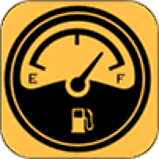
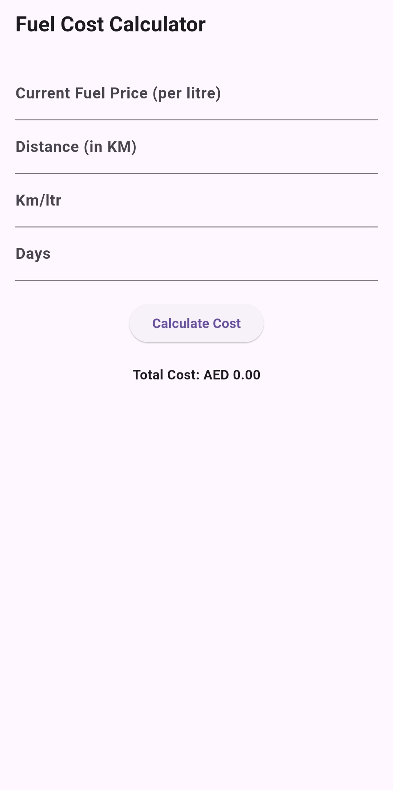

[

](assets/images/icon.png)

# Fuel Calculator

An app in which a user can calculate the fuel cost for a trip based on current fuel price, car gas mileage and distance.

The app currently shows KM, Litres and Price in AED (although it the number can be taken as any currency).

This app has been made possible mainly by using ChatGPT by OpenAi, Perplexity.Ai and some of my minimal knowledge of Flutter and other programming languages.

## Screenshots

